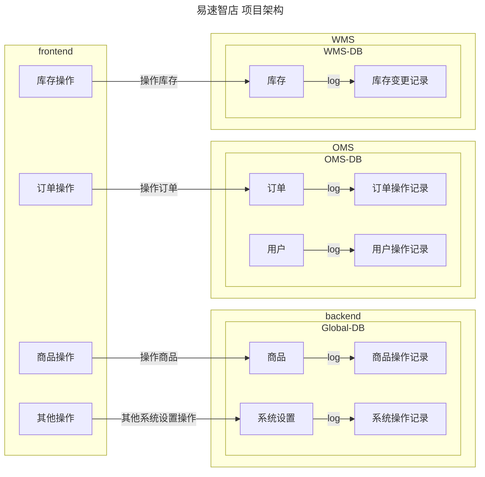

# 易速智店
> 易速智店 - 全平台实现最小 OMS+WMS，将小微商品管理成本降至零，为小微经济注入活力与动力  

## 背景
> 基于国家小微经济发展规划政策，融通小微商业星火资源 
* 市场：小微经济体量大，需求强
* 政策：国家大力支持小微经济，尤其是地摊经济的发展
* 需求：市面上大部分`ERP`过于臃肿，不适合小微经济使用

## 原理流程

isu简化了整个ERP系统，将其简单的抽象为两个核心功能，OMS订单系统和WMS库存系统。

整个系统简化成了这个样子：  
(atomgit似乎不能显示mermaid)

但是，麻雀虽小，五脏俱全，对于小微商业交易来说完全够用。

## 项目目录

- 后端
  - server - 服务器版
  - localserver - 本地服务版
- 前端
  - Web - 网站版
  - Desktop APP - 桌面版
  - Mobile APP - 手机版
- 数据库
  - MySQL（适用于服务器版）
  - SQLite（适用于服务器版和本地服务版）

<!-- ## 运行说明
> 说明如何运行和使用你的项目，建议给出具体的步骤说明
* 操作一
* 操作二
* 操作三  

## 测试说明
> 如果有测试相关内容需要说明，请填写在这里  

## 技术架构
> 使用的技术框架或系统架构图等相关说明，请填写在这里  

## 协作者
> 高效的协作会激发无尽的创造力，将他们的名字记录在这里吧 -->